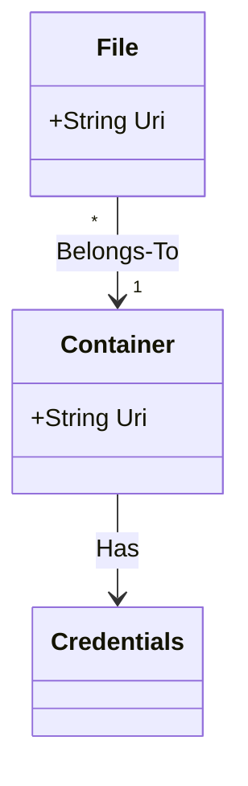
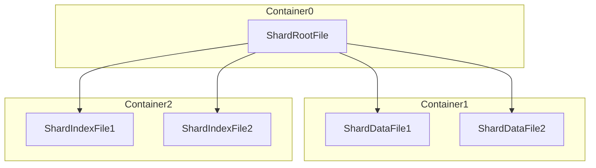

# Chapter 3: Persistent Storage

<!-- toc -->

By "persistent storage" [^persistent-storage] we mean the system that stores the files/blobs/storage-artifacts/etc.
that hold the column store data. Some common examples are the OS filesystem, a SMB file share,
Azure Storage, Fabric OneLake, AWS S3, etc. Each of these has its own way to represent storage
concepts such as files, directories, volumes, and credentials, so we use an abstract logical
model that can be "mapped" to a specific persistent storage implementation.

The following table can be used to map the PS world to actual implementations.

|PS name    |Filesystem (Windows)|Azure Storage |AWS S3|
|-----------|--------------------|--------------|------|
|File       |File                |Blob          |Object|
|Container  |Directory           |Blob Container|Bucket|
|Uri        |Path                |Uri           |Uri   |

Every file belongs to a single container. Both are referenced through a Uri. To access a file
or a container, the system often requires access to credentials. In the most general case,
credentials are are per-container; this happens, for example, when each container exists in a different
Storage Account (Azure) or S3 Bucket (AWS).

~~~admonish warning
The following mermaid diagram won't render in mdbook currently, because mdbook-mermaid
apparently uses an old version of mermaid. Just ignore this for now...
~~~

~~~admonish
Credentials should be stored in some credentials store, outside the persistent storage mechanism itself.
For example, Azure users can store Storage Account keys in Azure Key Vault. Even better, in some scenarios
credentials might be completely eliminated and the system rely on being assigned a managed identity to
access storage, or access storage using credentials provided by the user when a request is made.
Such details are outside the scope of this document.
~~~

## Storage Model Basics: Files and Containers

At any given moment, a table's data is held by any number of **data shards**. Every data shard can be thought-of as
a horizontal "slice" of the table, and the union over all data shards is the table's data.

Each data shard is persisted in storage as one or more **files**. Every file belong to one **container**.
A single data shard is allowed to have files from multiple containers, and there can be advantages for doing so.
For example, one might use cheap/slow storage for the bulk of the data shard's data, and fast/expensive storage
for metadata and indexes.

The files that make up a data shard are **immutable**; once written, they are "sealed" and can never be modified again.
(They can still be deleted of course, but the contents of such files never changes.) This allows data shards to be read
by multiple independent processes, makes them easy to cache (there's no need for cache coherency mechanisms), etc.
As the data shard is the sum of its files, an implication is that **data shards are immutable** as well; any modification
operation of the table's data by definition mutates the set of data shards of the table, without changing each of the
data shards themselves.

Allowing a single data shard to span multiple files not only allows these files to exist in containers that suite their
optimal price/performance choice, but also makes it possible to share files between data shards. For example, one might
represent an operation that merges two data shards to create a new data shard by writing a small new metadata file which
points at the old data files of the data shards being merged. Such a model adds complexity to file management, but can make
merge operations (particularly of data shards with large data files) more efficient, as data does not need to be duplicated
(saving storage space) nor copied (improving performance).

## Referencing Files and Containers

Referencing files and containers is done through **monikers**, strings that follow the [URI-reference](https://www.rfc-editor.org/rfc/rfc3986#section-4.1) syntax.

Monikers that point at files that are in the same container as the data shard's root file
SHOULD do so by using a relative reference. This means that in the simple case (all of
the data shard's files being in the same container), none of the data shard's files
holds any absolute Uri, they are all relative to the implicit base Uri (the absolute
Uri of the data shard's root file's location).

~~~admonish example
Suppose a data shard whose root file is in Azure Blob Storage with the Uri
`https://storageaccount.blob.core.windows.net/blobcontainer/Table0/2024-11-15/Guid0/root.amudai`.
A data shard also has an index file at Uri
`https://storageaccount.blob.core.windows.net/blobcontainer/Table0/2024-11-15/Guid0/indexes/idx0.amudai`.
The root file can then reference the data file using it's absolute Uri, but a much shorter way
would be to use the relative reference `indexes/idx0.amudai`.
~~~

Notice that in this example, the storage container is `https://storageaccount.blob.core.windows.net/blobcontainer`.
The relative reference that the root file holds is to its own location, which has the relative Uri to the storage
container of `Table0/2024-11-15/Guid0`.

For security reasons, relative Uris cannot "climb out" of the root file's scope. Thus, relative Uris such as
`../../../path/to/something/else` are illegal.

### Persistent Storage Services and Absolute/Relative Uris

In an ideal world, there would have been a way to uniquely identify the persistent storage service from the Uri.
Realistically, many services prefer to use `https://` absolute Uris, making it harder to determine the driver required
to communicate with the service from the Uri. (For example, both Azure Blob Storage and Amazon S3 use this scheme,
and to differentiate between them one needs to check the DNS zone of the hostname.)

Relative Uris don't have this problem, as they are always relative to a specific container, so the relevant persistent storage service
is the container's service.

---

[^persistent-storage]: Often, this will be abbreviated as "PS".