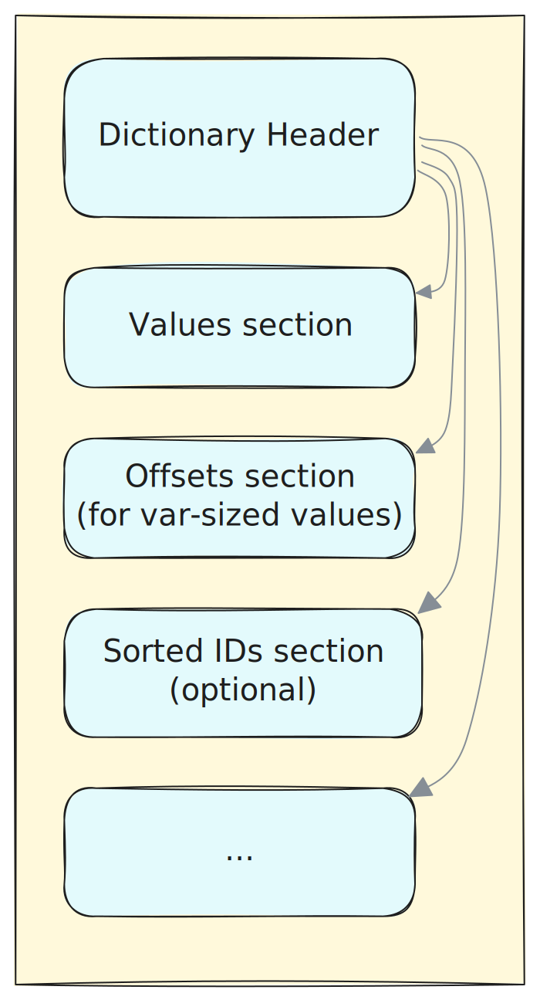

# Chapter 6: Shard Format Details

This chapter provides a detailed specification of the data structures used in the shard format.

<!-- toc -->

## Overview and Recap

The high-level structure of a shard is explained in [Chapter 5](./chapter_5_shard_structure.md). To summarize, the diagram below outlines the main components of the storage format. It employs one of the recommended file-level layouts: a single "root" file that contains all the shard directory metadata elements, along with one or more data files that store the encoded data for the shard's fields, plus optionally, one or more index files.

The primary component of a shard is the `ShardDirectory`. Each shard consists of one or more stripes, and the layout of a stripe is defined by the `StripeDirectory`. Another crucial component is the `FieldDescriptor`. At the shard level, a field descriptor brings together the essential properties of a field (or nested schema element) from all stripes. At the stripe level, it also points to where the actual data for a field is stored.


## Common Building Blocks

### Endianness

Unless stated otherwise, all fixed-size numbers are stored in little-endian format.

### Checksums

Checksums play a crucial role in the shard format by ensuring the integrity of metadata messages and various data buffers within the shard. In this specification, whenever we refer to a checksum, it is a 32-bit value calculated using the following method:

```rust,ignore
let h = xxh3_64(data);
let checksum = ((h >> 32) as u32) ^ (h as u32);
```

Here, `xxh3_64` represents the 64-bit [XXH3](https://xxhash.com/) hash function, which is used without a seed.

### Message Serialization

Individual protobuf messages are stored in the following format:


The "Message length" refers to the size of the encoded Protobuf message in bytes. This does not include the checksum or the message length field itself.

**Note**: Readers are advised to set reasonable limits on recursion depth when decoding the Protobuf messages outlined in this document.

### Logical/Position/Byte range

This utility structure is designed to represent a range with non-negative boundaries, which can also be empty. It can be used for various purposes, such as indicating a range of logical value positions within an array or specifying a range of byte positions in a storage blob.

```protobuf
message UInt64Range {
    // Inclusive
    fixed64 start = 1;
    
    // Exclusive
    fixed64 end = 2;
}

message UInt32Range {
    // Inclusive
    fixed32 start = 1;
    
    // Exclusive
    fixed32 end = 2;
}
```

Thus, the length of the range is calculated as `end - start`.

### DataRef

`DataRef` provides a generic way to reference any piece of data within an Amudai shard:

```protobuf
message DataRef {
  //  Reference to content within the blob specified by `url`
  // (either relative or absolute one).
  // When the url is missing or empty, this is a self-reference
  // (`range` is within the current file).
  string url = 2;
  
  // Data byte range, with absolute positions within the containing blob.
  // `start` is inclusive, `end` is exclusive.
  // An empty range is valid (`start == end`).
  UInt64Range range = 3;
}
```

As outlined in [Chapter 3 - Persistent Storage](./chapter_3_persistent_storage.md):
- Relative URLs are based on the directory containing the "root" shard artifact.
- Relative URLs cannot navigate outside the scope of the root shard file.
- URLs must not contain any secrets.

### DataRefArray

In certain situations, it's necessary to represent a potentially large sequence of `DataRef`s. `DataRefArray` provides a "shredded" layout of such collections for more efficient handling:

```protobuf
message DataRefArray {
  repeated string url = 2;
  repeated fixed64 start = 3;
  repeated fixed64 end = 4;
}
```

### AnyValue

Some parts of the shard metadata allow for the use of dynamically-typed values, typically as custom properties in various property bags. We define a `AnyValue` as a generalization of the built-in Protobuf `Value` message, adapted to represent any scalar value within the basic type system outlined in [Chapter 4](./chapter_4_type_system.md).

```protobuf
message AnyValue {
    oneof kind {
        UnitValue null_value = 1;
        bool bool_value = 2;
        uint64 u64_value = 3;
        int64 i64_value = 4;
        double double_value = 5;
        DateTimeUtc datetime_value = 6; 
        TimeSpan timespan_value = 7; 
        string string_value = 8;
        bytes bytes_value = 9;
        ListValue list_value = 20;
        StructValue struct_value = 21;
        DataRef data_ref = 22;
    }
    
    // An optional annotation, URL or resource name that identifies
    // the semantic type of this value.
    optional string annotation = 30;
}

message UnitValue {}

// DateTime as defined in the `Type System` chapter
message DateTimeUtc {
    // 100-nansosecond ticks passed since 0001-01-01
    fixed64 ticks = 1;
}

// TimeSpan as defined in the `Type System` chapter
message TimeSpan {
    // 100-nansosecond ticks
    fixed64 ticks = 1;
}

message ListValue {
    repeated AnyValue elements = 1;
}

message StructValue {
    repeated NameValuePair fields = 1;
}

message NameValuePair {
    string name = 1;
    AnyValue value = 2;
}
```

**Note**: One of the supported `AnyValue` variants is `DataRef`, which acts as a reference to an externally stored buffer containing a serialized message with the rest of the `AnyValue` representation. When decoding or reconstructing this value, readers should be cautious about the number of hops they follow.

### BytesList

`BytesList` is designed to efficiently handle sequences of variable-sized buffers (either `string` or `binary`) by reducing the overhead associated with deserialization and memory allocation.

```protobuf
message BytesList {
    repeated fixed64 offsets = 1;
    bytes data = 2;
}
```

- `offsets`: This is a list of offsets within the `data` buffer. The first offset, `offsets[0]`, is always zero, and the length of `offsets` is one more than the number of buffers it represents.
- `data`: This field contains all the buffers concatenated together. Each buffer can be accessed using the formula `value[i] = data[offsets[i]..offsets[i + 1]]`.

## Shard Directory

The Shard Directory Table of Contents (ToC) is always located at the end of the Amudai blob. It adheres to the metadata message serialization format, which includes the length, binary message, and checksum. Following this, the `uint32` length is repeated, and the sequence concludes with an 8-byte file footer:


In the [Iceberg](https://iceberg.apache.org/) [manifest](https://iceberg.apache.org/spec/#manifests), any reference to an Amudai shard will point to a "root" blob that includes the ToC message described above. This could be a single-file Amudai shard, a file containing both the ToC and other shard directory elements, or a file with only the ToC.

*Convention*: File names containing the shard directory should end with the `.amudai.shard` suffix.

Shard Directory Protobuf specification:

```protobuf
message ShardDirectory {
    // Reference to a `Schema` message.
    DataRef schema_ref = 1;
    
    // Reference to a `ShardProperties` message.
    DataRef properties_ref = 2;
    
    // Reference to a `DataRefArray` (list of field descriptor refs).
    DataRef field_list_ref = 3;
    
    // Reference to a `StripeList` message.
    DataRef stripe_list_ref = 4;
    
    // Reference to a `UrlList` message.
    DataRef url_list_ref = 5;
    
    // Reference to a shard-scoped `IndexCollection` message.
    DataRef indexes_ref = 6;

    fixed64 total_record_count = 7;
    fixed64 deleted_record_count = 8;
    fixed64 stripe_count = 9;
    
    optional fixed64 raw_data_size = 10;
}
```

### Schema

The `Schema` message is referenced by the `schema_ref` within the shard directory.

The shard schema is essentially a hierarchy of `DataType` nodes. Each `DataType` has a `schema_id` property, which is a sequentially assigned integer starting from zero. This `schema_id` is used by other elements within the shard format to reference a schema node, particularly in the Field Descriptor List.

Before decoding any data in the shard, it is essential to first resolve the relevant fields in the schema. The `Schema` message is stored using the FlatBuffers encoding to prevent the need for time-consuming deserialization of numerous `DataType` nodes when only a few fields need to be read.

```
enum BasicType : ubyte {
    Unit = 0,
    Boolean = 1,
    Int8 = 2,
    Int16 = 3,
    Int32 = 4,
    Int64 = 5,
    Float32 = 6,
    Float64 = 7,
    Binary = 8,
    FixedSizeBinary = 9,
    String = 10,
    Guid = 11,
    DateTime = 12,
    List = 13,
    FixedSizeList = 14,
    Struct = 15,
    Map = 16,
    Union = 17,
}

// DataType node in the hierarchical schema.
table DataType {
    // Basic type (primitive or composite)
    basic_type: BasicType;

    // Schema ID of the field.
    schema_id: uint32;

    // Field name, relevant for `Struct` fields and `Union` variants.
    // Otherwise, it should be empty, and is ignored by the implementation.
    field_name: string (required);

    // Optional aliases field aliases, relevant only for `Struct` fields.
    field_aliases: [string];

    // Child type nodes for the composite types.
    // Remains empty for the primitive types.
    children: [DataType] (required);

    // Whether the type is signed (meaningful only for integer types).
    signed: bool;

    // Fixed size, meaningful only for `FixedSizeBinary` and `FixedSizeList`.
    // For `FixedSizeBinary`: this is the type size in bytes.
    // For `FixedSizeList`: this is the number of list elements.
    fixed_size: uint64;

    // Optional extended type annotation
    extended_type: ExtendedTypeAnnotation;
}

// Top-level record field.
table Field {
    data_type: DataType (required);
    // Optional internal field marker
    // (e.g. deleted records, ingestion timestamp, unique record id).
    internal_field_annotation: InternalFieldAnnotation;
}

table Schema {
    fields: [Field] (required);
}

table ExtendedTypeAnnotation {
    label: string (required);
    properties: [ExtendedTypeProperty] (required);
}

table ExtendedTypeProperty {
    name: string (required);
    value: PropertyValue (required);
}

enum PropertyValueKind : ubyte {
    // Null value
    Null = 0,
    // Simple string
    String = 1,
    // Json string
    JsonString = 2,
    // Protobuf `AnyValue` as defined in the `common.proto`.
    AnyValueProto = 3,
}

table PropertyValue {
    kind: PropertyValueKind;
    data: [ubyte] (required);
}

table InternalFieldAnnotation {
    kind: string (required);
}
```

The top-level fields in a shard's schema typically match the columns in a table. These fields may include an optional `InternalFieldAnnotation` property. If this property is present, it indicates a special internal field with a specific role within the data shard. The initial set of supported internal fields is detailed in [Chapter 5](./chapter_5_shard_structure.md#schema). The well-known `kind` can be:
- `Kusto.Amudai.DeletedRecord`
- `Kusto.Amudai.IngestionTimestamp`
- `Kusto.Amudai.RecordIdentity`

### Shard Properties

The `ShardProperties` message is referenced by the `properties_ref` field in the shard directory.

```protobuf
message ShardProperties {
    DateTimeUtc creation_min = 1;
    DateTimeUtc creation_max = 2;
    repeated NameValuePair standard_properties = 3;
    repeated NameValuePair custom_properties = 4;
}
```

- `creation_min`, `creation_max`: These fields are mandatory, and define the range of timestamps marking the shard's creation period. When a shard is first created, both timestamps are identical. However, they may vary as shards undergo merging.

```admonish note
We currently don't include a reference to special types of tags that the Kusto engine uses, such as `drop-by` and `ingest-by`
tags. These can be set within the `standard_properties` collection. We may have the default writer implementation avoid merging
shards that have _any_ `standard_properties` set.
```

```admonish todo
1. Specify how field values are set when shards are merged:
   - `creation_min` (and `creation_max`) is set to the min (or max) of creation times among all shards being merged together.
   - `standard_properties`, `custom_properties` are concatenated (the result may contain several entries with the same names).
```

### Field Descriptor List

The Field Descriptor List is a `DataRefArray` message, where each `DataRef` links to a `FieldDescriptor` or `StripeFieldDescriptor`. The position of each entry in this array matches the `schema_id` of the data type node in the shard schema. If a `DataRef` is empty (meaning it has an empty range), then the corresponding schema node lacks a storage representation. In this case, it's as if all the values for that field are treated as `null`.

### URL List

```protobuf
message UrlList {
    repeated string urls = 1;
}
```

This is a list of all unique artifact URLs used within this shard, meaning they are referenced by any of its `DataRef` elements. This list is mandatory and complete.

### Stripe List

The `StripeList` is referenced by the `stripe_list_ref` in the shard directory.

```protobuf
message StripeList {
    repeated StripeDirectory stripes = 1;
}

message StripeDirectory {
    // Reference to a `StripeProperties` message.
    DataRef properties_ref = 1;
    
    // Reference to a `DataRefArray` stripe field descriptors list.
    DataRef field_list_ref = 2;
    
    // Reference to a stripe-scoped `IndexCollection` message.
    DataRef indexes_ref = 3;

    fixed64 total_record_count = 4;
    fixed64 deleted_record_count = 5;
    
    optional fixed64 raw_data_size = 6;

    fixed64 record_offset = 7;
}

message StripeProperties {
    repeated NameValuePair standard_properties = 1;
    repeated NameValuePair custom_properties = 2;
}
```

### (Shard) Field Descriptor

In the hierarchical shard schema, each element - whether it's a top-level field or a nested one - may have a field descriptor. If a field descriptor is missing, it indicates that all values for that field are `null` within the relevant scope, whether it's a stripe or the entire shard.

```protobuf
message FieldDescriptor {
    fixed64 position_count = 1;
    optional fixed64 null_count = 2;
    optional AnyValue constant_value = 3;
    optional fixed64 dictionary_size = 4;
    optional RangeStats range_stats = 6;
    optional CardinalityInfo cardinality = 7;
    optional MembershipFilters membership_filters = 8;
    optional IndexCollection indexes = 9;
    repeated NameValuePair standard_properties = 10;

    oneof type_specific {
        StringStats string_stats = 20;
        ListStats container_stats = 21;
        BooleanStats boolean_stats = 22;
        DecimalStats decimal_stats = 23;
        FloatingStats floating_stats = 24;
        BinaryStats binary_stats = 25;
    }
    
    repeated NameValuePair custom_properties = 40;
    optional fixed64 raw_data_size = 41;
}

message RangeStats {
    AnyValue min_value = 1;
    bool min_inclusive = 2;
    AnyValue max_value = 3;
    bool max_inclusive = 4;
}

message StringStats {
    fixed64 min_size = 1;
    optional fixed64 min_non_empty_size = 2;
    fixed64 max_size = 3;
    optional fixed64 ascii_count = 4;
}

message BooleanStats {
    fixed64 true_count = 1;
    fixed64 false_count = 2;
}

message ListStats {
    fixed64 min_length = 1;
    optional fixed64 min_non_empty_length = 2;
    fixed64 max_length = 3;
}

message BinaryStats {
    fixed64 min_length = 1;
    optional fixed64 min_non_empty_length = 2;
    fixed64 max_length = 3;
}

message DecimalStats {
    fixed64 zero_count = 1;
    fixed64 positive_count = 2;
    fixed64 negative_count = 3;
    fixed64 nan_count = 4;
}

message FloatingStats {
    fixed64 zero_count = 1;
    fixed64 positive_count = 2;
    fixed64 negative_count = 3;
    fixed64 nan_count = 4;
    fixed64 positive_infinity_count = 5;
    fixed64 negative_infinity_count = 6;
}

message CardinalityInfo {
    optional fixed64 count = 1;
    bool is_estimate = 2;
    optional AnyValue hll_sketch = 3;
}

message MembershipFilters {
    optional SplitBlockBloomFilter sbbf = 1;
}

message SplitBlockBloomFilter {
    fixed64 num_blocks = 1;
    double target_fpp = 2;
    fixed64 num_values = 3;
    string hash_algorithm = 4;
    bytes data = 5;
}
```

**CardinalityInfo properties:**
- `count`: If present, provides the exact or estimated number of distinct values
- `is_estimate`: Boolean flag indicating whether the `count` field contains an estimate (`true`) or exact count (`false`)
- `hll_sketch`: Optional HyperLogLog sketch data for cardinality estimation, stored as an `AnyValue`

**MembershipFilters properties:**
- `sbbf`: A Split-Block Bloom Filter for efficient approximate membership queries with excellent cache locality.

**Important Note**: `MembershipFilters` are only populated at the stripe level within `StripeFieldDescriptor`, not at the shard level in `FieldDescriptor`.

**SplitBlockBloomFilter properties:**
- `num_blocks`: The number of 256-bit (32-byte) blocks in the filter. Must be a power of 2
- `target_fpp`: The target false positive probability used when sizing the filter (e.g., 0.01 for 1%)
- `num_values`: The number of distinct values that were inserted into the filter during construction
- `data`: The raw filter data as a sequence of 256-bit blocks stored in little-endian byte order
- `hash_algorithm`: Identifier for the hash algorithm used (e.g., "xxh3_64"). Must produce consistent results across architectures
```

- The only mandatory property is `position_count`, which indicates the number of logical "value slots" (logical positions) in this field's stored sequence. The other properties are optional and are primarily relevant to primitive data types.

- `null_count`: If present, this specifies the number of logical value slots containing `null` values.

- `constant_value`: If present, this indicates that all value slots contain the same value, including the possibility that all values are null. Such a field might not have any data encodings at the stripe level.

- `dictionary_size`: When present, this specifies the size of the dictionary containing all distinct values for this field, including the null value. *Note*: The presence of this information does not necessarily mean that there's an actual value dictionary stored, although this is usually the case at the stripe level.  

- `range_stats`: Provides the minimum and maximum values for the stored sequence, where the range bounds may be inclusive or exclusive. The exact meaning of the min and max values depends on the primitive type:
    - For all data types, these stats ignore `null` values.
    - For floating-point types, these stats ignore `NaN` values but consider positive and negative infinity.
    - For `binary` and `string` types, the min and max values are computed based on byte-lexicographic ordering.

- `cardinality`: Estimates the number of distinct values in the field, with `null` counted as a single distinct value.
    - See [CardinalityInfo message definition](#cardinalityinfo-properties) above for the structure specification.
    - May contain exact counts, estimates, or HyperLogLog sketches for cardinality estimation.

- `indexes`: Optional indexes specific to the field (these can exist alongside multi-field indexes at the shard or stripe level).

- `standard_properties`: Additional properties associated with the field.

- `membership_filters`: Optional approximate membership query (AMQ) filters for the values of the field. **Note**: This field is only populated when the `FieldDescriptor` is used at the stripe level (within `StripeFieldDescriptor`). At the shard level, this field remains empty.

- `StringStats`: Applicable only for the `string` type. All sizes are measured in bytes, not code points.
    - `min_size` and `max_size`: Indicate the minimum and maximum sizes of the strings, in bytes.
    - `min_non_empty_size`: Indicates the minimum size of a non-empty string, in bytes.
    - `ascii_count`: Represents the number of value slots containing ASCII-only strings (strings with only code points below 128).  

- `BooleanStats`: Applicable only for the `boolean` type.
    - `true_count`: The number of value slots equal to `true`.
    - `false_count`: The number of value slots equal to `false`.

- `ListStats`: Relevant for variable-length `List` and `Map` types.
    - `min_length`: The minimum length of the container.
    - `min_non_empty_length`: The minimum length of a non-empty container.
    - `max_length`: The maximum length of the container.

- `BinaryStats`: Relevant for `binary` types (where `binary` is treated as a container of bytes).
    - `min_length`: The minimum length of the binary chunk.
    - `min_non_empty_length`: The minimum length of a non-empty container.
    - `max_length`: The maximum length of the binary chunk.

- `DecimalStats`: Applicable only for decimal types (128-bit precision).
    - `zero_count`: The number of decimal values that are zero.
    - `positive_count`: The number of decimal values that are positive (greater than zero).
    - `negative_count`: The number of decimal values that are negative (less than zero).
    - `nan_count`: The number of decimal values that are NaN (Not a Number).

- `FloatingStats`: Applicable only for floating-point types (`f32`, `f64`).
    - `zero_count`: The number of floating-point values that are zero.
    - `positive_count`: The number of floating-point values that are positive (greater than zero).
    - `negative_count`: The number of floating-point values that are negative (less than zero).
    - `nan_count`: The number of floating-point values that are NaN (Not a Number).
    - `positive_infinity_count`: The number of floating-point values that are positive infinity.
    - `negative_infinity_count`: The number of floating-point values that are negative infinity.
  
- `raw_data_size`: Represents the size of the data in its raw, uncompressed format in bytes. This is the theoretical size of the data before any encoding, compression, or optimization is applied. The calculation varies by data type:

  For fixed-size data types (int32, int64, float32, float64, bool, etc.), the raw data size is calculated as the count of non-null values multiplied by the size of the data type in bytes. For example, 100 non-null int64 values would have a raw data size of 100 × 8 = 800 bytes.

  For variable-length data types (string, binary, lists, maps), the raw data size is the sum of the length in bytes of all non-null values. For strings, this is the sum of UTF-8 byte lengths of all non-null strings. For binary data, it's the sum of byte lengths of all non-null binary values. For lists and maps, it's the sum of the serialized byte lengths of all non-null containers.

  Null value handling follows these rules: If the field contains no null values, raw_data_size includes only the actual data. If the field contains some null values, raw_data_size excludes null values from the calculation since nulls contribute 0 bytes to the raw size. If all values in the field are null, raw_data_size equals 0.

  This metric is useful for compression ratio calculations (compressed_size / raw_data_size), memory usage estimation for uncompressed data processing, understanding the effectiveness of encoding schemes, and query planning and resource allocation decisions.

*Note*: All the value statistics mentioned above are calculated for the entire stored sequence of values at the corresponding scope (shard or stripe) and do not account for logically deleted records.

## Stripe Field Descriptor

The Stripe Field Descriptor shares part of its definition with a base Field Descriptor but includes an additional list of data encodings.

```protobuf
message StripeFieldDescriptor {
    FieldDescriptor field = 1;
    repeated DataEncoding encodings = 2;
}
```

The `StripeFieldDescriptor` contains a list of data encodings, each offering an alternative way to represent the sequence of values. Typically, you'll find just one `DataEncoding` in this list. However, if there are multiple encodings, they should be arranged by priority, with the most efficient one for decoding placed first. When accessing the field's values, the reader should always try the first data encoding and use the others only as backups if the first isn't fully supported.

### Data Encoding

```protobuf
message DataEncoding {
    oneof kind {
        NativeDataEncoding native = 1;
        ExternalParquetDataEncoding parquet = 2;
    }
}

message NativeDataEncoding {
    repeated EncodedBuffer buffers = 1;
    bool packed_group = 10;
}

message ExternalParquetDataEncoding {
    ...
}
```

The data encoding for a field can be either native to Amudai, as detailed below, or it can reference data stored externally in a different format. Initially, Amudai supports external column chunks in Parquet files, as specified in the [External Parquet Encoding](#external-parquet-encoding) section.

`NativeDataEncoding` properties:
- `buffers`: A collection of encoded buffers.
- `packed_group`: This feature is explained in the section on [Packed Group Encoding](#packed-group-encoding).

The `NativeDataEncoding` of a field is expressed through one or more encoded buffers. [Chapter 7](./chapter_7_data_encoding.md) provides detailed information on how these buffers are stored, including aspects like chunking, compression, and layout. Each buffer plays a distinct role in representing the data. The types of buffers defined include:

- `DATA`: Stores the sequence of actual values, which can be either fixed-size primitives or variable-sized byte slices concatenated in sequence.
- `PRESENCE`: Indicates the presence of `null` values within the field. It stores presence flags for each logical position, conceptually as a sequence of `bool` values, where `true` indicates the presence of a value at the corresponding position and `false` indicates a `null`.
- `OFFSETS`: Works alongside the `DATA` buffer for variable-sized types such as `string` and `binary`. It stores the end-of-value offsets of the corresponding byte slices in the `DATA` buffer. Logically, this is a sequence of `uint64` values starting from zero, with a length one greater than the number of value slots. A variable-sized value at logical position `i` has a byte range `offsets[i]..offsets[i + 1]` in the `DATA` buffer.
- `VALUE_DICTIONARY`: Supports the dictionary encoding of values. It associates a unique integer ID (`uint32`) with each distinct value of the field within the stripe, while the `DATA` buffer stores a sequence of these dictionary IDs.
- `OPAQUE_DICTIONARY`: An opaque dictionary buffer used by the general-purpose block compressor as a shared dictionary across multiple blocks. A block that uses this dictionary will reference the corresponding dictionary buffer in its header.
- `RANGE_INDEX`: Stores numeric range index data for numeric fields.

The following sections review encodings specific to data types.

#### Primitive Fixed-Size Types Encoding

This section covers `Boolean`, integer, floating-point, `DateTime`, `GUID`, and `FixedSizeBinary` types.

The encoding typically includes a `DATA` buffer that holds a sequence of values. If there are any `null` values, a `PRESENCE` buffer is optionally used to indicate their positions. Alternatively, presence information can be embedded directly within a single `DATA` buffer.

#### Primitive Variable-Sized Encoding

This section covers the encoding methods for `string` and `binary` data types. There are a few variations to consider:

1. Separate Buffers for Data and Offsets:
   - The `DATA` buffer contains a sequence of byte buffers stacked together. Each "value slot" in this buffer is represented by a single byte, with its logical position corresponding to the byte's position.
   - The `OFFSETS` buffer holds a sequence of `uint64` byte offsets pointing into the `DATA` buffer.
   - Optionally, a `PRESENCE` buffer can be used to indicate `null` values.

2. Delimited Data Buffer:
   - The `DATA` buffer contains a sequence of strings, each with its length embedded within the encoding. In this case, no separate `OFFSETS` buffer is required.
   - Optionally, a `PRESENCE` buffer can be used to indicate `null` values.

3. Single Embedded Data Buffer:
   - A single `DATA` buffer is used, with both offsets and presence information embedded within the encoding. No separate `OFFSETS` or `PRESENCE` buffers are needed in this configuration.

#### Dictionary Encoding

Dictionary encoding can be applied to both variable and fixed-size data types. When this encoding is used, the data section will include at least two buffers: `DATA` and `VALUE_DICTIONARY`. The `DATA` buffer contains a sequence of `uint32` dictionary IDs that represent the values, while the `VALUE_DICTIONARY` buffer maps each dictionary ID to its corresponding value or `null`. As a result, the `PRESENCE` buffer is not necessary for this encoding, although it can still be included if desired.

#### List Encoding

For a schema node of type `List<T>` with `N` logical positions (i.e., a sequence of `N` variable-length lists), the field descriptor will include the following encoding:

- An `OFFSETS` buffer that stores `N + 1` logical offsets pointing into the child element sequence of type `T`. The first value in this buffer is zero.
- An optional `PRESENCE` buffer, included if the list is nullable (meaning there are `null` lists within the sequence, as opposed to merely empty lists).

#### Map Encoding

For a schema node of type `Map<K, V>` with `N` logical positions (i.e., a sequence of `N` variable-length maps), the field descriptor will have the following encoding:

- An `OFFSETS` buffer that stores `N + 1` logical offsets into the child key sequence of type `K`. These offsets also delineate the child value sequence of type `V`. The buffer starts with a zero value.
- An optional `PRESENCE` buffer, used if the map is nullable (indicating some `null` maps exist in the sequence, as opposed to empty maps).

#### Struct Encoding

For a schema node of type `Struct<...>`, the field descriptor will include:

- An optional `PRESENCE` buffer if the struct is nullable.

For each field within the struct, the logical position of the child element aligns directly with the logical position of the struct itself.

#### Fixed Size List Encoding

For a schema node of type `FixedSizeList<size, T>`, the field descriptor will include:

- An optional `PRESENCE` buffer if the list can be null.

If there are `N` lists in the sequence, the encoding of the child elements mirrors that of the element `T`, but it covers `N * size` logical positions. For a fixed-size list value at logical position `i`, the range of its child elements is defined by `i * size` to `(i + 1) * size`.

#### Union Encoding

In a schema node defined as `Union<f0: T0, f1: T1, ...>`, the field descriptor will contain the following:

- A `DATA` buffer, which holds the union discriminator. This is formally a `u8` data type and indicates which child element is valid at that position. The index of the child element matches the order of the child node in the `Union` schema definition.

For every variant of the union, the logical position of the child element directly corresponds to the logical position of the union itself.

```admonish todo
The approach outlined above is known as a "dense" encoding method. We also need to detail the "sparse" approach. In this method, the union `DataEncoding` includes an `OFFSETS` buffer that points to the logical positions of a child sequence, alongside a discriminator `DATA` buffer.
```

### Encoded Buffers

The `DataEncoding` element consists of one or more `EncodedBuffer` descriptors:

```protobuf
message EncodedBuffer {
    BufferKind kind = 1;
    DataRef buffer = 2;
    optional DataRef block_map = 3;
    optional fixed64 block_count = 4;
    bool block_checksums = 5;
    bool embedded_presence = 6;
    bool embedded_offsets = 7;
    optional fixed32 buffer_id = 20;
    optional fixed32 packed_group_index = 21;
}

enum BufferKind {
    DATA = 0;
    PRESENCE = 1;
    OFFSETS = 2;
    VALUE_DICTIONARY = 3;
    OPAQUE_DICTIONARY = 4;
    RANGE_INDEX = 5;
}
```

- `kind`: Specifies the type of buffer and its function within the data encoding scheme for the specified field.
- `buffer`: A reference to the entire encoded buffer, covering both the compressed data part and the block map if present.
- `block_map`: A reference to the block map, which is the tail end of the encoded buffer.
- `block_count`: The total number of independently compressed blocks in the buffer, applicable if a block-based structure is used.
- `block_checksums`: When block-based compression is applied (`block_count != 0`), this specifies whether checksums are appended to each encoded block. These checksums cover the block header and block data, calculated using the method detailed in [Checksums](#checksums). For more information, see [Chapter 7](./chapter_7_data_encoding.md).
- `embedded_presence`: If `true`, presence information (i.e., `null`s) is embedded in the value blocks. Details are in [Chapter 7](./chapter_7_data_encoding.md). Typically, each block designates a special value to represent `null`. This is only applicable within a buffer with `BufferKind::DATA`.
- `embedded_offsets`: If `true`, offsets for variable-sized values are stored within each block rather than as a separate encoded buffer. This is relevant only for `string` and `binary` fields and is only valid within a buffer with `BufferKind::DATA`.
- `buffer_id`: An optional numerical buffer identifier. If present, it must be unique within the containing `DataEncoding`. This ID can reference a specific auxiliary encoded buffer from within the encoded blocks of the primary data buffer (e.g., referencing a specific value dictionary if there are multiple).
- `packed_group_index`: Refer to [Packed Group Encoding](#packed-group-encoding).

**Note**: The start of each encoded buffer within the Amudai file container format must be aligned to a 64-byte boundary.

#### Value Dictionary

The value dictionary is stored as a contiguous buffer containing two or more sections.
Below are the descriptions of every section.

##### Value Dictionary Header

The first section is value dictionary header, which consists of:

- `value_type`: This indicates the data type of the values in the dictionary. It can be any of the following primitive types: `i16`, `u16`, `i32`, `u32`, `i64`, `u64`, `f32`, `f64`, `String`, `Binary`, `FixedSizeBinary<N>`, `GUID`, `DateTime`. The type should match the formal type of the schema element whose values are dictionary-encoded.
- `value_count`: Number of entries in the dictionary, including the null entry.
- `null_entry_present`: A boolean flag indicating whether null ID is present.
- `null_id`: If present, this specifies the dictionary ID for the `null` value.
- `fixed_value_size`: For fixed-sized values, it's set to the value size. Otherwise, it's set to 0.
- `values_section_size`: Size of the dictionary values section, in bytes.
- `offsets_section_size`: Size of the values offsets section, in bytes. For fixed-sized values, it's set to 0.
- `sorted_ids_section_range`: Size of the sorted IDs section, in bytes.

The header section is accompanied with the length (4 bytes) at the beginning and the checksum (4 bytes)
at the end.

##### Values Section

The dictionary values section is a contiguous buffer, consisting of all values concatenated together.

For variable sized values, the buffer is a list of `Binary` or `String` values, where the ordinal position
of each value corresponds to its dictionary ID.

In fixed-sized values dictionaries, for a value with dictionary ID `i` and primitive type `T`, the value bytes
are located at `values[i * sizeof(T)..(i + 1) * sizeof(T)]`, in little-endian format.

The values section is accompanied with the length (8 bytes) at the beginning, followed by the payload data,
64 bytes of padding, and the checksum (4 bytes) at the end. The entire section starts on a 16-byte 
alignment boundary.

##### Offsets Section

This is an optional section for variable sized values dictionary, encoded as a list of offsets (u64)
that are used for locating individual values in the values buffer. The number of offsets is N + 1,
where N is a number of unique values in the dictionary (including null value, if exists).
The first offset is always 0.

The offsets section is accompanied with the length (8 bytes) at the beginning, followed by the payload data,
64 bytes of padding, and the checksum (4 bytes) at the end. The 8-byte length prefix preserves 8-byte 
alignment of the offsets buffer, allowing it to be interpreted as a slice of u64 values directly.
The entire section starts on a 16-byte alignment boundary.

##### Sorted IDs Section

A list of dictionary IDs (u32) ordered by their corresponding values (NOT including the null value, if exists).
The sort order is ascending, using natural comparison rules for numeric types and byte-lexicographic comparison
for `String`, `GUID`, and `Binary` types.

The sorted IDs section is accompanied with the length (8 bytes) at the beginning, followed by the payload data,
64 bytes of padding, and the checksum (4 bytes) at the end. The entire section starts on a 16-byte 
alignment boundary.

In summary, the overall layout of the dictionary buffer is illustrated below:



##### Dictionary Section Alignment and Padding Benefits

The 16-byte alignment with 64-byte padding in dictionary sections enables two key optimizations:

1. **Direct Casting to Wide Types**: Fixed-size value buffers can be safely cast to wider types like 
   `&[u128]` without alignment violations, enabling efficient bulk operations on 16-byte values.

2. **SIMD Vectorization**: The alignment enables efficient AVX-2 (32-byte) and AVX-512 (64-byte) 
   SIMD operations for loading string values and performing vectorized comparisons and searches 
   across dictionary entries.

#### Packed Group Encoding

By default, composite types in Amudai use a "column shredding" technique for storage. This means each node in the schema tree is assigned its own set of encoded buffers, making data compression and retrieval more efficient. Let's break this down with an example: suppose a table field is of type `S`:

```rust,ignore
Field S ::= struct { a: int32, b: int32, c: int32 }
```

The hierarchical schema for this field will include a struct node `S` with three child nodes: `S.a`, `S.b`, and `S.c`, all of type `int32`. Each schema node will have a corresponding field descriptor, which will point to a set of encoded column buffers. Now, let's assume that `S` and all its fields are non-nullable. This means there will be three separate buffers in storage: no buffer for `S` itself (since there's no need to store presence), and one `DATA` buffer each for `S.a`, `S.b`, and `S.c`. Each of these buffers will be stored as a sequence of independently compressed blocks.

However, sometimes this layout isn't ideal. If fields `S.a`, `S.b`, and `S.c` are frequently accessed together, each access requires three separate IO operations to fetch the blocks for `a`, `b`, and `c`. To optimize this, Amudai offers a solution called Packed Group Encoding. This method reduces unnecessary IO while retaining columnar compression benefits. Instead of storing fields as independent sequences of compressed blocks:


the struct `S` is stored as a *packed group*, interleaving uniform blocks from `a`, `b`, and `c`, and organizing them into a sequence of super-blocks:


In the storage format, this is represented as follows:
- The `DataEncoding` element in `S`'s field descriptor has the `packed_group` flag set to `true`.
- The `DataEncoding` for `S` refers to a single `EncodedBuffer` that stores a sequence of super-blocks interleaving `a`, `b`, and `c` in that order.
- The `DataEncoding/EncodedBuffer`s for `a`, `b`, and `c` do not reference any stored buffers; instead, each has a `packed_group_index` set to 0, 1, and 2, respectively.

The super-block format is detailed in [Chapter 7](./chapter_7_data_encoding.md). Essentially, it includes a block header that specifies the number of nested encoded blocks and their sizes, followed by the actual encoded blocks for each element of the packed group.

### External Parquet Encoding

```admonish todo
This section is still in the early stages and needs further brainstorming and review with our Parquet experts.
```

The `DataEncoding` for a field can point to externally stored Parquet column chunks using the `ExternalParquetDataEncoding` element. We intentionally avoid specifying how Parquet artifacts should be mapped to Amudai shards and their stripes, with one exception: we never reference partial column chunks (i.e., we do not slice them arbitrarily). Therefore, a single `ExternalParquetDataEncoding` element might reference multiple column chunks, which could originate from different Parquet files.

```protobuf
message ExternalParquetDataEncoding {
    repeated ParquetFileColumnRef file_column_refs = 1;
}

message ParquetFileColumnRef {
    DataRef file_ref = 1;
    repeated ParquetColumnChunkRef column_chunks = 2;
}

message ParquetColumnChunkRef {
    ParquetStorageType storage_type = 1;
    fixed32 schema_element_id = 2;
    fixed32 row_group_id = 3;
    fixed32 column_chunk_id = 4;
    optional string file_url = 5;
    UInt64Range data_pages_range = 6;
    fixed64 data_page_count = 7;
    optional UInt64Range dictionary_range = 8;
    optional DataRef data_page_map = 9;
}

enum ParquetStorageType {
    BOOLEAN = 0;
    INT32 = 1;
    INT64 = 2;
    INT96 = 3;
    FLOAT = 4;
    DOUBLE = 5;
    BYTE_ARRAY = 6;
    FIXED_LEN_BYTE_ARRAY = 7;
}
```

`ExternalParquetDataEncoding`
- `file_column_refs`: A list of references to column chunks in multiple Parquet files. Typically, this list will contain a single entry.

`ParquetFileColumnRef`
- `file_ref`: A reference to an entire Parquet file that includes one or more relevant column chunks.
- `column_chunks`: A list of column chunks from different row groups within the Parquet file.

`ParquetColumnChunkRef`: Represents a reference to an individual column chunk. Its specification was crafted with two main objectives:
1. Enable readers to swiftly access the necessary data pages, minimizing unnecessary I/O operations and bypassing the Parquet metadata when possible.
2. Provide the capability to trace the column chunk reference back to the complete Parquet metadata, including all pertinent definitions contained within it.

- `storage_type`: The "physical" data type of the column chunk.
- `schema_element_id`: The ordinal of the corresponding *SchemaElement* in the *FileMetaData.schema* list.
- `row_group_id`: The ordinal of the containing *RowGroup* in the *FileMetaData.row_groups* list.
- `column_chunk_id`: The ordinal of the *ColumnChunk* in the *RowGroup.columns* list.
- `file_url`: An optional URL pointing to the file that contains the column chunk data. This is used when it differs from the `file_ref` specified in `ParquetFileColumnRef`.
- `data_pages_range`: The range covering all data pages of the column chunk.
- `data_page_count`: The number of data pages in the column chunk.
- `dictionary_range`: The range covering all dictionary pages of the column chunk.
- `data_page_map`: An optional `DataRef` to a page lookup structure in Amudai, which serves the same purpose as a native `BlockMap` and follows the same format.

## Shard and Stripe Indexes

An index is a data structure designed to help query execution by avoiding a full scan of the data. Typically, an index is queried using a key or a set of keys derived from the values of the fields you are interested in. The result of such a query provides information about the logical positions of these values in the relevant fields.

Indexes can be applied to an Amudai shard at both the shard level and the stripe level. Shard-level indexes provide results that cover the entire range of logical positions within the shard, while stripe-level indexes offer results limited to the logical positions within a specific stripe.

This section covers information relevant to both shard-level and stripe-level indexes.

### Index Collection

The `IndexCollection` message is referenced by `indexes_ref` within either the shard directory or the stripe directory.

```protobuf
message IndexCollection {
    repeated IndexDescriptor index_descriptors = 1;
}
```

### Index Descriptor

The `IndexDescriptor` outlines the key characteristics of an index. Most details are specific to the type of index, and the initial indexes supported by Amudai are detailed in [Chapter 8](./chapter_8_indexes.md).

```protobuf
message IndexDescriptor {
    string index_type = 1;
    repeated NameValuePair properties = 2;
    repeated IndexedField indexed_fields = 3;
    repeated DataRef artifacts = 4;
    optional fixed64 index_size = 5;
}

message IndexedField {
    repeated fixed32 schema_ids = 1;
}
```

- `index_type`: Specifies the type of index, which defines its capabilities and how to interpret its storage format.
- `indexed_fields`: Lists the shard fields that are included in this index. For more details, see [Indexed Fields](#indexed-fields) below.
- `properties`: Contains additional index properties, determined by the `index_type`.
- `artifacts`: References all the storage artifacts associated with the index.
- `index_size`: Provides an estimated size of the index in bytes.

#### Indexed Fields

Let's clarify this concept with an example. Imagine a shard for a table with fields A, B, C, and D. Fields A, B, and C are of type `string`, while D is of type `int64`. Suppose there is an inverted term index within the shard that can handle simple term queries. For a given value of field X, the index returns a list of logical positions in the shard where field X matches this value. To save space and reduce I/O in full-text search scenarios, the index uses a single B-tree that covers values from fields A, B, and C. When queried with a term, the index returns all positions of the term in A, B, and C. Additionally, the same B-tree also supports a composite key `B+C` because it is a common search combination and part of the configured indexing policy. Assuming the schema IDs for A, B, C, and D are 0, 1, 2, and 3 respectively, the `indexed_fields` element in the index descriptor would look like this:

```json
{
    "index_type": "inverted-term-index",
    "indexed_fields": [
        { "schema_ids": [0] },
        { "schema_ids": [1] },
        { "schema_ids": [2] },
        { "schema_ids": [1, 2] }
    ]
}
```

## Split-Block Bloom Filters

Split-Block Bloom Filters (SBBF) are used throughout the Amudai format to provide efficient approximate membership queries with excellent cache locality and SIMD optimization opportunities.

### SBBF Algorithm

The SBBF implementation follows the Apache Parquet specification with these characteristics:
- **Block Size**: 256 bits (32 bytes)
- **Hash Functions**: 8 independent hash functions per element
- **Block Selection**: Uses the high bits of the hash to select a block
- **Bit Selection**: Uses the low bits to select 8 positions within the block

### Filter Storage Format

The SBBF is stored as a contiguous buffer with the following structure:

```protobuf
message SplitBlockBloomFilter {
    // Number of 256-bit blocks in the filter
    fixed64 num_blocks = 1;
    
    // Target false positive probability (e.g., 0.01 for 1%)
    double target_fpp = 2;
    
    // Number of distinct values inserted
    fixed64 num_values = 3;
    
    // The filter data as a sequence of 256-bit blocks
    bytes blocks = 4;
    
    // Hash algorithm used (e.g., "xxh3_64")
    string hash_algorithm = 5;
}
```

### Filter Sizing

The number of blocks is determined by:
- `m = -8 * n / ln(1 - fpp^(1/8))` where:
  - `n` = expected number of distinct values
  - `fpp` = target false positive probability
  - The result is rounded up to the next power of 2

### Usage in Field Descriptors

Bloom filters are maintained exclusively at the stripe level within `StripeFieldDescriptor` instances. They are **not** duplicated or merged at the shard level.

When two shards are merged, the resulting shard contains all stripes from the first shard followed by all stripes from the second shard. Each stripe field descriptor retains its existing bloom filters unchanged.

### Implementation Notes

- Filters are immutable once created
- The hash algorithm must produce consistent results across architectures
- The filter data is stored in little-endian byte order
