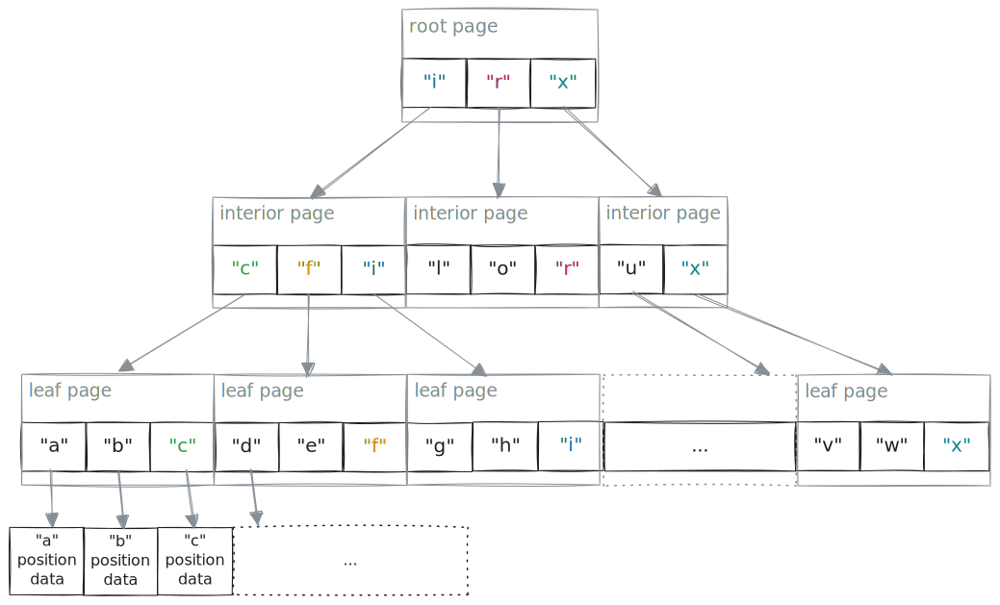

# Chapter 8: Indexes

<!-- toc -->

## Overview

Indexes are optional components that accompany an Amudai shard, designed to accelerate search and filtering operations, among other potential uses, when querying the shard. Generally, the creation and use of indexes are entirely optional. The concept of an index is both flexible and extensible; the Amudai specification does not enforce any particular format or semantics for an index. In this chapter, we outline the details of several types of Amudai indexes that are initially supported by the implementation. Depending on the type of index, it can be applied at the shard, stripe, or field level.

Amudai shards are immutable, meaning their indexes are also static. These indexes aren't designed for updates; instead, they are created once when the shard is initially built and are only rebuilt when necessary, for instance during shard merging. As a result, when one performs a lightweight shard editing operation, such as logically deleting a record, the indexes typically remain unchanged and may contain outdated information. It's up to the higher-level shard query logic to handle this situation and adjust the index results accordingly.

In the shard metadata, an index is identified by the `IndexDescriptor` element, as detailed in [Chapter 6](./chapter_6_shard_format_details.md). The key attributes of this descriptor are `index_type` and `indexed_fields`. The `index_type` determines the semantics, capabilities, and interpretation of the index's storage format, while `indexed_fields` specifies which fields the index includes. The `properties` element within the `IndexDescriptor` is tailored to the specific index type.

## Inverted Term Index
**index_type**: `"inverted-term-index-v1"`.

An inverted term index enables efficient searching for specific **terms** (also known as *tokens*, which are parts of a string) and provides an ordered list of all their occurrences within a shard. Typically, this index is attached at the shard level, although it can also be applied at the stripe level. It can encompass multiple fields within the shard, facilitating effective full-text or multi-field searches.

Here's how the conceptual model of this index works: The index construction process goes through all relevant columns in each stripe and examines every value. For each value, a `tokenizer()` function extracts a list of terms to be indexed. For every term extracted, the logical position of the **record** containing that term (within the stripe), along with its field and stripe information, is added to a list of positions associated with the term. At a high level, the result looks like this:

```json
{
    "term1": [
        {
            "stripe": 0,
            "fields": [
                {
                    "schema_id": 0,
                    "positions": [2, 5, 8, ...]
                },
                {
                    "schema_id": 1,
                    "positions": [3, 4, 10, ...]
                }
            ]
        },
        {
            "stripe": 1,
            "fields": [
                {
                    "schema_id": 0,
                    "positions": [7, 8, ...]
                },
                {
                    "schema_id": 2,
                    "positions": [5, 6, 11, ...]
                }
            ]
        }
    ],
    "term2": [...],
    ...
}
```

The numeric field identifier mentioned here corresponds to the `schema_id` of the `DataType` node within the shard's `Schema` element. The numeric stripe identifier simply represents the ordinal of the stripe within a shard.

It's important to note that in this type of index, the `positions` list refers to the logical positions of the top-level *records* that contain the terms. This holds true even if the term was extracted from a deeply nested field value.

The unique terms are then ordered and organized into a B-tree-like structure, typically 3-4 levels deep:



The entries in the root and interior pages of this B-tree are structured to facilitate a `lower_bound()` style search, which involves finding the first term entry in a page that is greater than or equal to the query term. Once this entry is found, its link is followed to the next-level page, continuing this process until a leaf page is reached. The leaf page contains the terms themselves, along with detailed position information. This information is organized by stripe and field, ultimately providing a list of logical record positions for a term within a specific field and stripe.

### Tokenizer

The tokenizer is responsible for extracting terms to be indexed from raw values, typically of the `string` type. The specific tokenizer used during the index construction is indicated in the `properties` of the stored index. Additionally, the tokenizer can be customized for individual fields. When performing a term search using the index, it's crucial that the pre-processing of the raw search phrase (i.e., term extraction) aligns with the tokenizer used in the index.

Tokenizers are one of the many extensibility features of the format, and their list is generally open-ended. However, we begin by outlining three types of tokenizers initially supported by Amudai. These are tailored specifically for "log analytics" scenarios, rather than for things like document searches or general RDBMS tasks. Their main goal is to offer storage-level support for efficiently implementing [KQL string operators](https://learn.microsoft.com/en-us/kusto/query/datatypes-string-operators).

#### Word Tokenizer
**tokenizer_name**: `"unicode-word"`.

This tokenizer pulls out "words" from a raw input by removing all delimiters. For example, if you have the string "Typically 3-4 levels deep," it extracts the terms `["Typically", "3", "4", "levels", "deep"]`. In more technical terms, these "words" are the longest continuous sequences of alphanumeric grapheme clusters. Each term must be at least one byte long, and any term longer than 128 bytes is truncated at the next codepoint boundary.

#### Log Tokenizer
**tokenizer_name**: `"unicode-log"`.

This tokenizer extends the functionality of `unicode-word` tokenizer by recognizing the following:

- IPv4 addresses properly separated by non-alphanenumeric characters. Example of a text string containing properly separated IPv4 addresses: "10.0.0.1|192.168.1.1,,8.8.8.8 1.1.1.1". In this example, four IPv4 addresses are extracted.

#### Trivial Tokenizer
**tokenizer_name**: `"trivial"`.

The Trivial Tokenizer doesn't extract any terms; it simply returns the raw value of the field unchanged. This makes it highly efficient for field equality and prefix searches, though it sacrifices flexibility. It's particularly well-suited for fields similar to GUIDs.

### Term B-tree Ordering

The ordering of terms in a B-tree is clearly defined by the `collation` property of the index. When comparing two terms, the collation function determines their relative order as either less than, equal to, or greater than. Terms are arranged in ascending order. While collations can be extended, this specification currently defines a single collation.

#### Case-Preserving Collation
**Collation**: `"unicode-case-preserving"`

- For two terms, `t1` and `t2`, start with a case-insensitive, Unicode-aware, lexicographic comparison.
- If `t1` is not equal `t2` under this comparison, return this ordering.
- If they are equal, perform a case-sensitive lexicographic comparison and use that result for ordering.

For example, terms "Abd", "abc", "aBc" will be ordered as `["aBc", "abc", "Abd"]`.

This collation allows for precise lookups and prefix scans, accommodating both case-sensitive and case-insensitive searches.

### Position Lists

A position list is the final result of an index query, detailing the record locations for a specific term across each stripe and field within that stripe where the term appears. Essentially, it's an ordered sequence of `uint64` record positions within the stripe, and it can be represented in one of four ways:

- Type 0: Exact Position List  
  This is a list of precise positions, such as `[10, 100, 101, ...]`. Each record at these positions is confirmed to contain the specified term.

- Type 1: Exact Position Ranges  
  This consists of precise position ranges, like `[10..20, 50..55, ...]`. Every record within these ranges is confirmed to contain the specified term.

- Type 2: Approximate Position Ranges  
  This includes *approximate* position ranges, such as `[10..20, 50..55, ...]`. Records within these ranges *might* contain the specified term.

- Type 3: Unknown Position List  
  In this case, any record within the stripe might contain the specified term.

The last two representations imply that, generally, the index result for a given record position can be a three-state value (`true`/`false`/`unknown`). This means the index might return false positives, necessitating further validation by accessing the actual data. The decision to use position lists that provide approximate results is determined by the index policy in place during shard creation, which is beyond the scope of this document. This approach allows for a trade-off between index accuracy and reduced index size and creation cost.

The selected position list type for a specific term/stripe/field is included in the leaf term entry within the term B-tree.

### Index Storage Format

The index storage is organized into two main components: "terms" and "positions." The "terms" component encodes the B-tree structure of the terms, while the "positions" component contains all the position lists, compressed and concatenated together. Each leaf page in the "terms" component carries a page-level `pos_list_start_offset` that marks the starting offset in the "positions" component for that page. Within a leaf page, every field entry stores only its `pos_list_end_offset`; the starting offset for the first entry on the page is the page-level value, and for subsequent entries it is the previous entry’s end offset. This design eliminates cross-page dependency during reads and simplifies iterators.

#### Terms Shard

The terms shard contains the B-tree structure with terms and navigation information. Each record in the shard represents a B-tree page (either interior or leaf). The shard uses the following schema:
```
type FieldPosition ::=
    Struct<
        field_schema_id: i32,
        repr_type: i8,
        pos_list_end_offset: i64
    >;

type TermPosition ::=
    Struct<
        stripe_id: i16,
        fields: List<FieldPosition>
    >;

type Entry ::=
    Struct<
        term: binary,
        child_position: i64,
        term_positions: List<TermPosition>
    >;

type BTreePage ::=
    Struct<
        level: i8,
        entries: List<Entry>,
        pos_list_start_offset: i64
    >;
```

Each B-tree page contains:
- **`level`**: The tree level (0 for leaf pages, >0 for interior pages)
- **`entries`**: List of entries, where each entry contains:
  - **`term`**: The term as binary data (for leaf pages) or separator key (for interior pages)
  - **`child_position`**: For interior pages, the child page number; for leaf pages, unused
  - **`term_positions`**: For leaf pages only, the position data organized by stripe and field
- **`pos_list_start_offset`**: For leaf pages only, the starting offset in the positions shard for this page

Within each `TermPosition`, position data is referenced through:
- **`stripe_id`**: The stripe identifier where the term appears
- **`fields`**: List of field references, each containing:
  - **`field_schema_id`**: The schema ID of the field containing the term
  - **`repr_type`**: How the position data is represented (0=positions, 1=exact ranges, 2=approximate ranges)
  - **`pos_list_end_offset`**: The ending offset in the positions shard for this field's position data

The starting offset for position data is computed as either the page-level `pos_list_start_offset` (for the first field entry on a page) or the previous field entry's `pos_list_end_offset`.

#### Positions Shard

The positions shard stores the actual position lists as a simple sequence of 64-bit integers. The shard has a minimal schema:

```
type PositionsData ::=
    Struct<
        position: i64
    >;
```

Position data is stored as a continuous stream of integers, with interpretation determined by the `repr_type` field in the corresponding terms shard entry:

- **Position List** (`repr_type = 0`): Each `i64` value represents an individual logical record position within the stripe.
- **Exact Ranges** (`repr_type = 1`): Values are stored in pairs (start, end) representing precise `inclusive..exclusive` ranges of logical record positions.
- **Approximate Ranges** (`repr_type = 2`): Values are stored in pairs (start, end) representing approximate `inclusive..exclusive` ranges where positions might contain the term.

Both shards use Amudai's standard shard format with single-stripe organization and minimal compression for optimal access patterns during queries.

### Mandatory Index Properties

For the inverted term index outlined in this section, the `IndexDescriptor` must include at least the `tokenizer_name` and `collation` properties. Additionally, its `artifacts` element should reference both the "terms" blob and the "positions" blob, which are encoded as Amudai single-blob shards:

```json
{
    "index_type": "inverted-term-index-v1",
    "indexed_fields": [...],
    "properties": {
        "tokenizer_name": "unicode-word | unicode-log | trivial",
        "collation": "unicode-case-preserving"
    },
    "artifacts": [
        {
            "url": "indexes/index.terms",
            "range": ...,
        },
        {
            "url": "indexes/index.positions"
            "range": ...,
        }
    ]
}
```

## Basic Numeric Range Index

The **Basic Numeric Range Index** provides efficient filtering capabilities for numeric data types by maintaining minimum and maximum values for consecutive blocks of data. This index type supports all Amudai numeric types, including:

- **Integers**: `i8`, `i16`, `i32`, `i64`, `u8`, `u16`, `u32`, `u64`
- **Floating-point types**: `f32`, `f64`
- **Temporal types**: `DateTime`, `TimeSpan`
- **Decimal types**

### Index Structure

The index covers fixed-size logical blocks of a single numeric column within a shard's stripe. Each logical block of the index typically covers **256 values** of the column, irrespective of the policy chosen for data encoding. For each covered block, the index maintains:

- **Minimum Value (`min_value`)**: The smallest value in the block
- **Maximum Value (`max_value`)**: The largest value in the block
- **Invalid Count (`invalid_counts`)**: The number of invalid values in the block (e.g. null values or NaN for floats)

The index data is stored as a dedicated encoded buffer of kind `RANGE_INDEX` in the stripe field encoding area. The buffer contains three encoded sections:

```json
{
    "min_values": [10.5, 15.2, 12.8, 0.0, ...],
    "max_values": [14.8, 18.7, 16.4, 0.0, ...],
    "invalid_counts": [0, 2, 1, 256, ...]
}
```

All three arrays have the same length, with each position corresponding to one logical block. When `invalid_counts` equals the block size (e.g., 256 for non-last blocks or the actual size of the last block), the corresponding `min_value` and `max_value` entries are ignored during query evaluation.

### Storage Format

The numeric range index appears as an encoded buffer of the relevant field and uses the following binary storage format:

```
┌─────────────────────────────────────────────────────────────┐
│                   Header (40 bytes)                         │
├────────────────────┬────────────────────────────────────────┤
│  version (u16)     │   basic_type (u8) | has_checksum (u8)  │
├────────────────────┴────────────────────────────────────────┤
│                logical_position_span (u64)                  │
├─────────────────────────────────────────────────────────────┤
│              payload0_size (u64) (min_values)               │
├─────────────────────────────────────────────────────────────┤
│              payload1_size (u64) (max_values)               │
├─────────────────────────────────────────────────────────────┤
│              payload2_size (u64) (invalid_counts)           │
├─────────────────────────────────────────────────────────────┤
│         logical_block_size (u16)  | padding (u16)           │
├============================================================─┤
│               Encoded Block 0 (min_values[])                │
│              (follows standard specification)               │
├─────────────────────────────────────────────────────────────┤
│      Checksum of Encoded Block 0 (optional, 4 bytes)        │
├─────────────────────────────────────────────────────────────┤
│               Encoded Block 1 (max_values[])                │
│              (follows standard specification)               │
├─────────────────────────────────────────────────────────────┤
│      Checksum of Encoded Block 1 (optional, 4 bytes)        │
├─────────────────────────────────────────────────────────────┤
│          Encoded Block 2 (invalid_counts[]) (optional)      │
│              (follows standard specification)               │
├─────────────────────────────────────────────────────────────┤
│      Checksum of Encoded Block 2 (optional, 4 bytes)        │
├─────────────────────────────────────────────────────────────┤
│                    Padding (optional)                       │
│              (to align to 64-byte boundary)                 │
└─────────────────────────────────────────────────────────────┘
```

**Note**: Each encoded block follows the standard Amudai encoded block specification, allowing for optional compression when beneficial. See [Chapter 7](./chapter_7_data_encoding.md) for details.

#### Structure of the Header

- **`version` (u16)**: Format version of the index for future compatibility (current version: 1)
- **`basic_type` (u8)**: The Amudai BasicType identifier for the indexed numeric type
- **`has_checksum` (u8)**: Boolean flag indicating whether a checksum is present (1 = present, 0 = absent)
- **`logical_position_span` (u64)**: Total number of values covered by this index
- **`payload0_size` (u64)**: Total size of the encoded block for `min_values` and optional checksum
- **`payload1_size` (u64)**: Total size of the encoded block for `max_values` and optional checksum
- **`payload2_size` (u64)**: Total size of the encoded block for `invalid_counts` and optional checksum. The block is optional (if all values are valid, this value will be zero).
- **`logical_block_size` (u16)**: Number of values per index block (typically 256)
- **`padding` (u16)**: Reserved for future use, must be set to 0

### Query Evaluation

When evaluating a range query `[query_min, query_max]`, the index performs the following for each block:

1. **Skip Invalid Blocks**: If `block.invalid_counts` equals the number of values in the block, skip the block (all values in the block are invalid). Note: for most blocks this will be `logical_block_size`, but the last block may contain fewer values.
2. **Skip Too Small Blocks**: If `block.max_value < query_min`, skip the block (all values too small).
3. **Skip Too Large Blocks**: If `block.min_value > query_max`, skip the block (all values too large).
4. **Scan Matching Blocks**: Otherwise, the block might contain matching values and must be scanned.

This approach is particularly effective for:

- **Time-series data** with natural ordering
- **Sorted or partially sorted columns**
- **Data with locality patterns**

### Limitations and Considerations

The numeric range index is designed with the following characteristics:

- **False Positives**: The index may indicate that a block contains values in the query range when it doesn't (if values are not uniformly distributed within the block).
- **No False Negatives**: If the index indicates a block can be skipped, it definitely contains no matching values.
- **Block Granularity**: The effectiveness depends on the block size and data distribution.
- **Type Specific**: Each numeric type requires its own index due to type-specific comparisons.
- **Immutable**: Like all Amudai indexes, updates require rebuilding.

The index is most effective when:

- Data has some natural ordering or clustering.
- Queries frequently filter on numeric ranges.
- The indexed column has good selectivity.
- Values within blocks have relatively narrow ranges.

## Hashmap Index

**index_type**: `"hashmap-index"`.

The hashmap index provides efficient O(1) lookup operations for hash-to-positions mappings within an Amudai shard. This index is particularly useful for exact key lookups, equality searches, and implementing JOIN operations where fast key-based retrieval is critical.

### Index Structure

The hashmap index is organized as a distributed hash table across multiple partitions to enable parallel construction and balanced load distribution:

#### Hierarchical Organization

- **Partitions**: Top-level divisions that distribute entries across separate Amudai shards based on the most significant bits of hash values
- **Buckets**: Hash-based groupings within each partition shard for efficient range queries
- **Entries**: Individual hash-to-positions mappings stored within buckets

The formal data structure schema is:

```
type ShardRecord = Bucket;
type Bucket = List<Entry>;
type Entry = Struct<Hash, PositionsList>;
type Hash = UInt64;
type PositionsList = List<UInt64>;
```

#### Partitioning Strategy

The index uses a two-level hashing scheme:

1. **Partition Selection**: Uses the most significant bits of the hash to determine which shard contains the entry:
   ```
   partition_index = hash >> (64 - partition_bits)
   ```

2. **Bucket Selection**: Uses the least significant bits to determine the bucket within the partition:
   ```
   bucket_index = hash & (buckets_count - 1)
   ```

### Construction Process

The hashmap index builder creates the index through these phases:

1. **Entry Distribution**: Hash-position pairs are distributed across partitions based on their hash values
2. **Parallel Aggregation**: Within each partition, entries with identical hashes are aggregated using disk-based sorting to handle large datasets
3. **Bucket Organization**: Aggregated entries are sorted by bucket index for efficient access patterns
4. **Shard Creation**: Each partition is written as a separate Amudai shard with a single stripe containing all buckets

#### Memory Management

The builder supports configurable memory limits and uses temporary files for aggregation when dealing with large datasets. The number of parallel aggregation workers is automatically determined based on available memory and system parallelism.

### Lookup Process

To retrieve positions for a given hash value:

1. **Determine Partition**: Calculate which shard contains the target hash using the most significant bits
2. **Calculate Bucket Index**: Use the least significant bits to identify the target bucket within the partition
3. **Read Bucket**: Retrieve the specific bucket record from the shard using Amudai's columnar access
4. **Scan Entries**: Search through the bucket's entries for the exact hash match (O(1) expected due to load balancing)

### Storage Format

The index is stored as multiple Amudai shards (one per partition) with the following characteristics:

- **Schema**: Each shard uses a single-stripe layout with the bucket schema defined above
- **File Naming**: Partition shards are stored as `part{N}.shard` (e.g., `part0.shard`, `part1.shard`)
- **Bucket Size**: The number of buckets per partition is calculated as `(unique_entries_count / 2).next_power_of_two().max(2)`

### Index Properties

For the hashmap index, the `IndexDescriptor` includes the following structure:

```json
{
    "index_type": "hashmap-index",
    "indexed_fields": [...],
    "properties": {
        // No required properties for basic hashmap index
    },
    "artifacts": [
        {
            "url": "indexes/part0.shard",
            "range": ...
        },
        {
            "url": "indexes/part1.shard", 
            "range": ...
        }
        // ... additional partitions
    ]
}
```

### Performance Characteristics

The hashmap index offers:

- **O(1) Expected Lookup Time**: Constant-time retrieval for exact hash matches
- **Parallel Construction**: Scales with available CPU cores and memory
- **Memory Efficiency**: Uses disk-based aggregation for large datasets during construction
- **Load Balancing**: Distributes entries evenly across partitions using hash-based partitioning

### Use Cases

The hashmap index is particularly effective for:

- **Exact Key Lookups**: Finding all records with a specific key value
- **Equality Filters**: Supporting `field == value` queries efficiently  
- **JOIN Operations**: Implementing hash joins between datasets
- **Deduplication**: Identifying duplicate records based on computed hash values
- **Reference Resolution**: Mapping identifiers to their corresponding record positions

### Limitations and Considerations

- **Exact Match Only**: Does not support range queries or prefix searches
- **Hash Collisions**: Multiple different keys may hash to the same value (though positions lists handle this correctly)
- **Storage Overhead**: Requires additional storage for the index structure
- **Immutable**: Like all Amudai indexes, updates require complete rebuilding

## Vector Similarity Index

```admonish todo title="TODO"
Specify vector ANN index
```
